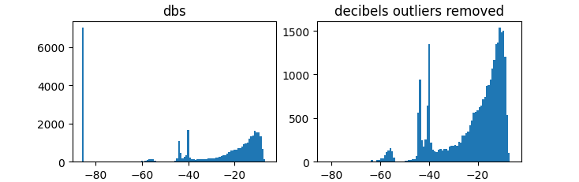

# Silence remover
Weekend project to remove silences in a video.

## Logic
Statistically removes outliers by a confidence interval of 95% and calculates the decibel threshold for the sound.



## Installation
```bash
pip install requirements.txt
```

## Usage
```bash
python main.py -i {input_file_path} -o {output_file_path}
```